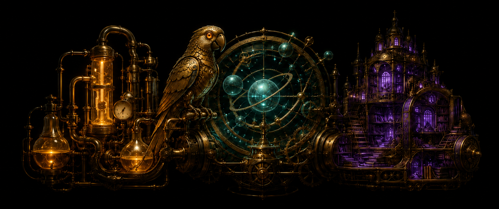
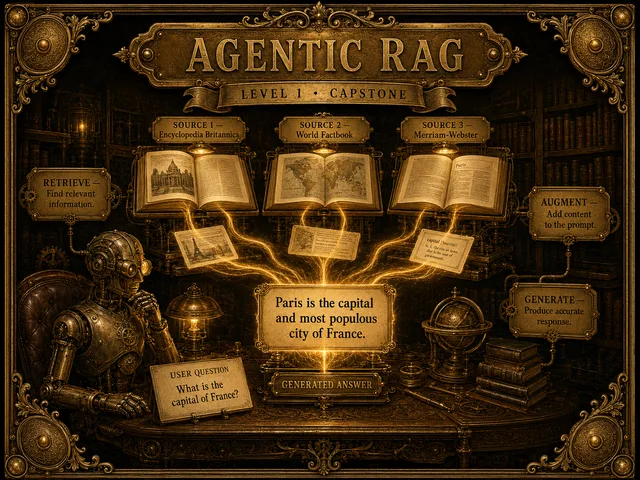
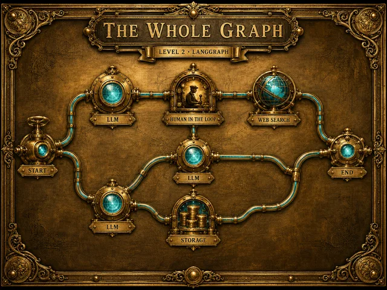
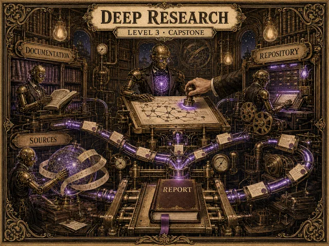
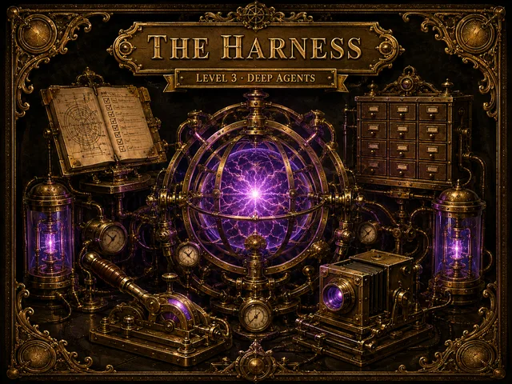

<div align="center">



# LangX

**An interactive course in AI engineering — learn the LangChain stack by watching it run.**

LangChain · LangGraph · Deep Agents — 29 lessons, 3 levels, every concept a live demo you run and inspect in the browser.


</div>

---

## What it is

LangX is a self-contained, in-browser course on building with the LangChain ecosystem. It is not a set of slides about agents — it is a set of agents you can run. Each lesson pairs a hand-illustrated explainer with a working demo that executes client-side against real model APIs: stream a model token by token, fork a state graph mid-run, approve an agent's plan, audit a live SEC filing, or watch a deep agent research real sources and cite them.

The whole thing runs as a static site. There is no backend to deploy and nothing to install for the reader — you bring a model key (or a local model) and everything happens in your browser.

### Why it's different

- **Every concept is executable.** Around two dozen runnable demos, one per idea — from a single tool-calling loop to a self-planning deep-research agent.
- **The wiring is never hidden.** Watch tokens stream, state mutate, tools fire, and graphs branch in real time.
- **Bring your own model.** Anthropic, OpenAI, Google, or Azure — or a local model in-browser via `transformers.js`. Your keys stay in your browser.
- **Built on the real stack.** The same `@langchain/*` and `langgraph` packages you'd reach for in production, nothing mocked.
- **Live, not canned.** Embedded GPT-2 runs in the browser, the auditor reads real EDGAR filings, and the research capstone fetches real sources.

---

## The curriculum

<table>
<tr>
<td width="33%" valign="top">

### Level 1 — LangChain
*The foundation layer.*

Six composable primitives that all speak one interface, the Runnable. Pipe them together and you get chains, RAG, and agents.

- Overview — the whole picture
- The Model (live GPT-2)
- Runnables & LCEL
- Streaming
- Structured output
- Tools
- `createAgent`
- Middleware & hooks
- **Capstone:** Agentic RAG

</td>
<td valign="top">

### Level 2 — LangGraph
*The orchestration layer.*

Model an agent as a stateful graph — nodes, edges, and reducers — that loops, branches, checkpoints, and pauses for a human.

- The whole graph
- StateGraph
- Conditional edges & reducers
- Checkpointers & time travel
- Interrupts & HITL
- Streaming modes
- Send & fan-out
- **Capstone:** Subgraphs

</td>
<td valign="top">

### Level 3 — Deep Agents
*The cognitive harness.*

Planning, a virtual filesystem, parallel subagents, skills, and context compaction — the machinery that turns a brief into a long-running agent.

- The harness
- Virtual filesystem
- The plan board
- Backends
- Filesystem permissions
- Subagents
- Skills
- Context compaction
- Human-in-the-loop
- **Capstone:** Deep Research
- **Capstone:** Data Science
- Beyond this course

</td>
</tr>
</table>

---

## A few of the demos

<table>
<tr>
<td width="50%"></td>
<td width="50%"></td>
</tr>
<tr>
<td align="center"><b>Agentic RAG</b><br>A document agent that searches, cites, and clarifies.</td>
<td align="center"><b>The whole graph</b><br>See every LangGraph primitive at once.</td>
</tr>
<tr>
<td width="50%"></td>
<td width="50%"></td>
</tr>
<tr>
<td align="center"><b>Deep Research</b><br>Plan, approve, research real sources, cite.</td>
<td align="center"><b>The harness</b><br>A brief becomes a playable game.</td>
</tr>
</table>

---

## Getting started

```sh
# install
npm install

# run the dev server
npm run dev

# build the static site, then preview it
npm run build && npm run preview
```

LangX builds with `@sveltejs/adapter-static`, so `npm run build` produces a fully static site you can host anywhere (GitHub Pages, Netlify, Cloudflare Pages, an S3 bucket).

### Choosing a model

Open **Setup** in the app and add a key for any supported provider — Anthropic, OpenAI, Google, or Azure. Keys are kept in your browser (IndexedDB) and are only ever sent to the provider you choose. Prefer to run nothing externally? Pick a local model and it runs in-browser via `transformers.js` (WebGPU where available).

---

## Tech stack

| Area | Tools |
|------|-------|
| Framework | SvelteKit 2, Svelte 5 (runes), TypeScript, Vite |
| Styling | Tailwind CSS v4, custom editorial type system (Fraunces / Source Serif / Mona Sans / IBM Plex Mono) |
| LLM / agents | `langchain` v1, `@langchain/core`, `@langchain/langgraph`, provider SDKs for Anthropic · OpenAI · Google · Azure |
| In-browser models | `@huggingface/transformers`, `onnxruntime-web` |
| Visualization | D3, `d3-sankey`, `@observablehq/plot`, Mermaid, KaTeX |
| Content & code | mdsvex, Shiki, `marked`, `js-tiktoken` |
| Storage / docs | Dexie (IndexedDB), `pdfjs-dist`, Zod |
| Tests | Vitest, Playwright |

---

## Project structure

```
src/
  routes/                    # landing page + the three level chapters;
                             #   each lesson is its own route
  lib/
    curriculum.ts            # the course map (levels, lessons, banners)
    demos/                   # the runnable demos — one per concept
    components/              # Slide deck, glossary Term tooltips, TopNav, …
    models/                  # provider catalog (Anthropic/OpenAI/Google/Azure/local)
    transformer-explainer/   # the embedded, live GPT-2 visualizer
    state/                   # app + nav state (Svelte runes)
static/
  images/                    # the hand-illustrated banners + level posters
  images/thumbs/             # generated WebP thumbnails (see scripts/make-thumbs.mjs)
```

---

## Credits

Built by [Neo Mohsenvand](https://github.com/NeoVand) · [LinkedIn](https://www.linkedin.com/in/mohsenvand/).

The artwork is a custom steampunk illustration set; the type and layout are a bespoke editorial design.
